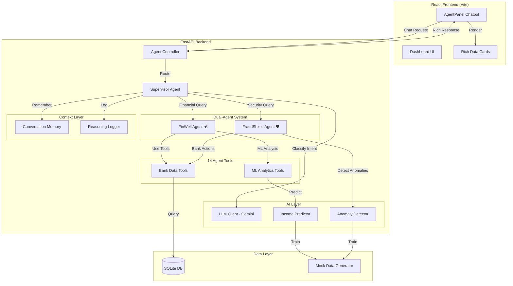

# 🧠 GXS Agentic Financial Intelligence Platform

> **GrabHack 2.0 — Problem 9-11**: GenAI-powered agentic financial tools for underserved segments

[](https://fastapi.tiangolo.com/)
[](https://react.dev/)
[](https://ai.google.dev/)
[](LICENSE)

---

## 🏆 What We Built

An **agentic AI platform** that serves as a proactive financial wellness coach and real-time fraud mitigation system for **gig economy workers** (Grab drivers, food delivery partners). Unlike traditional banking chatbots that simply answer questions, our system:

- **Thinks autonomously** — classifies intent, selects tools, and builds multi-step reasoning chains
- **Acts proactively** — generates financial insights without being asked
- **Explains its reasoning** — every decision is logged in a transparent reasoning log (hackathon deliverable)
- **Degrades gracefully** — works fully in rule-based mode when LLM is unavailable

### 🎯 Two Agentic Domains

| Agent | Domain | Key Capabilities |
|-------|--------|-------------------|
| **FinWell** 💰 | Financial Wellness Coach | Income forecasting, day-off affordability, savings recommendations, spending analysis, budget optimization |
| **FraudShield** 🛡️ | AI Fraud Mitigation | Transaction anomaly detection, real-time risk scoring, autonomous card freezing, security alerts |

---

## 🏗️ Architecture



### Comprehensive Request Flows

The platform is structured into 13 key functional domains. Every request originates from `frontend-starter/src/api.js` using a token-based JWT `ApiClient`, routes through FastAPI controllers, executes business logic in Services, and persists via Repositories to the SQLite database.

| Domain | Controller (`com.gxs.bank.controller`) | Service (`com.gxs.bank.service`) | Repository | Core Actions & Flow |
|--------|----------------------------------------|----------------------------------|------------|---------------------|
| **Auth** | `AuthController.py` | `AuthService.py` | `UserRepository` | Register, Login, Me (`GET /api/auth/me`). Generates JWT via `JwtTokenProvider`. |
| **Accounts** | `AccountController.py` | `AccountService.py` | `AccountRepository`, `TransactionRepository` | Create, List, Deposit, Withdraw, Transfer. Enforces ACID balance updates. |
| **Cards** | `CardController.py` | `CardService.py` | `CardRepository` | Apply, List, Freeze, Update Settings. |
| **Loans** | `LoanController.py` | `LoanService.py` | `LoanRepository` | Apply, Calculate EMI, Repay, dynamic rate logic. |
| **KYC** | `KycController.py` | `KycService.py` | `KycRepository` | Submit documents, retrieve verification status. |
| **Fixed Deposits**| `FixedDepositController.py` | `FixedDepositService.py` | `FixedDepositRepository` | Create FD (transfers from Account), List, Break FD (credits Account). |
| **Bills** | `BillPaymentController.py` | `BillPaymentService.py` | `BillPaymentRepository` | List billers, Pay bills (debits account). |
| **Beneficiaries** | `BeneficiaryController.py` | `BeneficiaryService.py` | `BeneficiaryRepository` | Add, List, Delete payees. |
| **Notifications** | `NotificationController.py` | `NotificationService.py` | `NotificationRepository` | List, Mark Read, Unread count. Pushed by system events. |
| **Admin** | `AdminController.py` | `AdminService.py` | (Multiple) | Maker-checker workflows. Approve/Reject Cards and Loans. |
| **Agents** | `AgentController.py` | `orchestrator.py`, CrewAI / LangGraph | `AgentMemory` (Chroma), LLMs | Conversational AI, Fraud SSE streams, OCR, auto-executors. |
| **Promotions** | `PromotionController.py` | `PromotionService.py` | `PromotionRepository` | Retrieve active marketing banners/promos. |
| **Contact** | `ContactController.py` | `ContactService.py` | `ContactRepository` | Submit support tickets. |

### How the Agent Thinks

```
User: "Can I take a day off?"
    │
    ▼
[Supervisor] → Intent Classification (keyword/LLM)
    │           → Result: "day_off" → Route to FinWell
    ▼
[FinWell Agent] → Step 1: Get account balance (S$3,547.82)
    │           → Step 2: Predict weekly income (S$876.30)
    │           → Step 3: Calculate weekly expenses (S$462.00)
    │           → Step 4: Find lowest-earning day (Tuesday)
    │           → Step 5: Generate recommendation
    ▼
[Response] + [Rich Data Card] + [Reasoning Log with 5 steps]
```

---

## 🚀 Quick Start

### Prerequisites

- Python 3.9+
- Node.js 18+
- (Optional) Gemini API Key for LLM-enhanced responses

### 1. Backend Setup

```bash
cd backend-python
pip install -r requirements.txt

# Optional: Set Gemini API key for LLM mode
cp .env.example .env
# Edit .env and add: GEMINI_API_KEY=your_key_here

# Start the server
python3 -m com.gxs.bank.GxsBankApplication
# → Runs on http://localhost:8081
```

### 2. Frontend Setup

```bash
cd frontend-starter
npm install
npm run dev
# → Runs on http://localhost:5173
```

### 3. Demo Login

| Account | Email | Password | Purpose |
|---------|-------|----------|---------|
| 🧠 **AI Demo (Grab Driver)** | `amir@demo.com` | `password` | Gig worker with 60 days of Grab income + fraud scenarios |
| 👤 Customer | `rahul@gxs.com` | `password` | Standard banking customer |
| 👔 Employee | `admin@gxs.com` | `password` | Admin dashboard |

---

## 🎮 Demo Scenarios

### Scenario 1: Day-Off Affordability
> "Can I afford to take a day off?"

The FinWell agent analyzes predicted weekly income, expenses, and surplus to recommend the best day to rest — showing a rich Day Off Analysis card.

### Scenario 2: Security Scan + Card Freeze
> "Scan my transactions for suspicious activity"
> "Freeze my cards"

FraudShield runs anomaly detection on 60+ transactions, identifies suspicious patterns (midnight foreign purchases, rapid ATM withdrawals), and can autonomously freeze cards.

### Scenario 3: Full Financial Health Report
> "Give me your best financial advice"

FinWell generates comprehensive advice covering income trends, spending analysis, savings recommendations, and day-off planning — all with rich data visualizations.

### Scenario 4: Income Forecast
> "What is my income forecast for this week?"

ML-powered prediction using historical Grab earnings with day-of-week patterns and trend analysis, rendered as a mini bar chart.

### Scenario 5: Spending Breakdown
> "Show me my spending breakdown"

Categorized spending analysis (fuel, meals, rent, groceries, phone) with percentages and visual breakdown.

---

## 🧪 Reasoning Log (Hackathon Deliverable)

Every agent interaction produces a detailed reasoning log accessible via the **🧪 Reasoning** tab:

```json
{
  "session_id": "abc-123",
  "query": "Can I take a day off?",
  "total_steps": 5,
  "duration_ms": 342,
  "steps": [
    {
      "step_number": 1,
      "action": "Intent Classification",
      "reasoning": "Classified as 'day_off' domain using keyword-matching",
      "tools_used": ["intent_classifier"],
      "agent_name": "Supervisor"
    },
    {
      "step_number": 2,
      "action": "Fetch Account Balance",
      "reasoning": "Need current balance to assess financial buffer",
      "tools_used": ["get_account_balance"],
      "agent_name": "FinWell"
    }
    // ... more steps
  ]
}
```

---

## 🛠️ Tech Stack

| Layer | Technology | Justification |
|-------|-----------|---------------|
| **Frontend** | React 18 + Vite | Fast HMR, modern JSX, tiny bundle |
| **Backend** | FastAPI | Async-first, auto-docs, Pydantic validation |
| **Database** | SQLite (SQLAlchemy ORM) | Zero-config for demo, production-ready ORM |
| **LLM** | Google Gemini API | Intent classification + natural language generation |
| **ML** | NumPy + Scikit-learn | Income prediction + anomaly detection |
| **Auth** | JWT (PyJWT + bcrypt) | Stateless auth for REST API |

---

## 📁 Project Structure

```
grabhack/
├── backend-python/
│   └── com/gxs/bank/
│       ├── agent/              # 🧠 Agentic AI System
│       │   ├── supervisor.py   # Orchestrator (intent routing)
│       │   ├── finwell_agent.py    # Financial Wellness Agent
│       │   ├── fraudshield_agent.py # Fraud Mitigation Agent
│       │   ├── tools.py        # 14 agent tools (bank + ML)
│       │   ├── llm_client.py   # Gemini API wrapper
│       │   ├── memory.py       # Conversation memory
│       │   └── reasoning_logger.py # Reasoning log
│       ├── ml/                 # Machine Learning
│       │   ├── anomaly_detector.py  # Isolation Forest / rule-based
│       │   ├── income_predictor.py  # Time-series prediction
│       │   └── mock_data_generator.py  # Grab gig worker data
│       ├── controller/         # REST API endpoints
│       ├── service/            # Business logic
│       ├── model/              # SQLAlchemy models
│       └── config/             # DB, CORS, security, seeder
│
├── frontend-starter/
│   └── src/
│       ├── pages/
│       │   ├── AgentPanel.jsx  # 🧠 AI Chatbot (primary UI)
│       │   ├── CustomerDashboard.jsx
│       │   └── LoginPage.jsx
│       ├── api.js              # API client (20+ endpoints)
│       └── styles.css          # 2600+ lines of premium UI
```

---

## 🔑 Key Design Decisions

1. **Chatbot-First UX**: All AI interactions happen through the floating chat panel, not embedded dashboard tabs. This mimics real-world financial assistant patterns (e.g., Google Pay advisor).

2. **Graceful Degradation**: The system functions fully without a Gemini API key — LLM enhances but never blocks. Rule-based fallbacks ensure the demo always works.

3. **Transparent Reasoning**: Every agent decision is logged with step-by-step reasoning, fulfilling the hackathon's requirement for "a Reasoning Log showing how the agent thought through a specific problem."

4. **Dual-Agent Architecture**: Separating FinWell and FraudShield allows specialized tooling and reasoning patterns per domain, while the Supervisor handles cross-domain queries seamlessly.

5. **Realistic Data**: 60 days of Grab ride/food earnings patterns, actual spending categories (fuel, meals, rent), and pre-seeded fraud scenarios make the demo compelling.

---

## 📋 Hackathon Deliverables Checklist

- [x] **Functional Prototype** — Full-stack demo with 5+ demo scenarios
- [x] **Agent Logic / Architecture Diagram** — Mermaid diagram in README
- [x] **Reasoning Log** — Step-by-step agent reasoning visible in UI (🧪 tab)
- [x] **Proactive Insights** — Auto-generated financial intelligence (💡 tab)
- [x] **README Documentation** — This file
- [ ] **2-Slide PPT** — In progress
- [ ] **2-Minute Demo Video** — In progress

---

## 👥 Team

Built for **GrabHack 2.0** by the team.

---

*Built with ❤️ for the underserved gig economy workforce*
>>>>>>> feature/python_conversion
