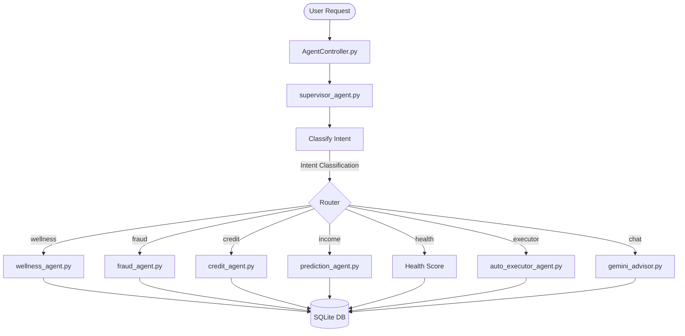
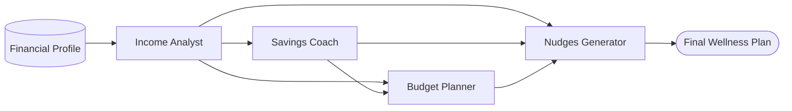
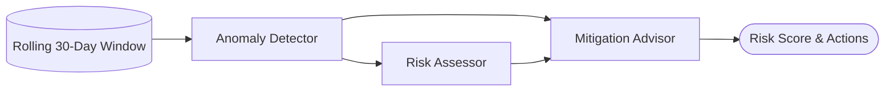
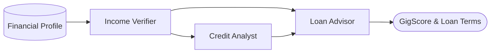
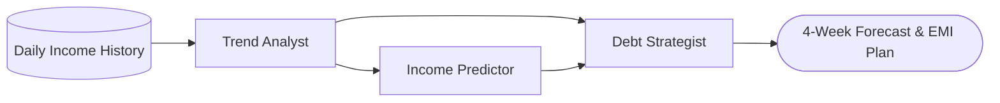

# GXS Bank Agentic Platform: Backend Architecture

This document provides a comprehensive, file-by-file analysis of the backend architecture for the GXS Bank Agentic Platform. It details the orchestration layer, the specific roles and implementations of all AI agents, and the core database logic. 

---

## 1. Orchestration & Graph Layer
The Orchestration layer is the brain of the platform. It intercepts user queries from the frontend, classifies the intent, routes the request to the appropriate agent (or a sequence of agents), and synthesizes the final response.

### `orchestrator_graph.py`
- **What it is supposed to do:** Act as the primary LangGraph StateGraph, replacing flat function calls with a directed acyclic graph (DAG) workflow for intent classification and routing.
- **What it is actually doing:** Defines a simple graph topology: `START → classify_intent → [Agent Nodes] → END`. It maps 8 intents (`wellness`, `fraud`, `credit`, `income`, `nudges`, `health`, `executor`, `chat`) to their respective agent nodes. If LangGraph is unavailable, it gracefully falls back to direct function calls.
- **Limitations:** It is relatively flat; it only routes to a *single* agent per request, unlike the more advanced Supervisor.

### `supervisor_agent.py`
- **What it is supposed to do:** An advanced, dynamic LangGraph supervisor capable of multi-agent workflows (e.g., calling `credit` + `income` + `wellness` in sequence for a `loan_assessment` intent).
- **What it is actually doing:** Implements a multi-step routing mechanism with a `SupervisorState`. It supports complex intents like `full_analysis` and `loan_assessment`, invoking multiple agents, aggregating their sub-results, and synthesizing a final human-readable summary. It also stores memories in ChromaDB (`agent_memory.py`) and logs every routing decision to SQLite.
- **Limitations:** Multi-agent workflows are hardcoded in `_MULTI_AGENT_PLANS`. It relies heavily on keyword matching (`_classify`) rather than LLM-based intent classification, which can be rigid.

### `orchestrator.py`
- **What it is supposed to do:** Provide a unified interface for legacy flat-function routing and CrewAI multi-agent crews.
- **What it is actually doing:** Contains wrapper functions (e.g., `get_financial_wellness`, `get_fraud_analysis`, `get_credit_score`) that fetch the user's financial profile from SQLite and pass it to the specific CrewAI agent scripts. It handles the `is_crewai_mode` and `is_live_mode` fallbacks.
- **Limitations:** Primarily acts as a passthrough layer now that `supervisor_agent.py` exists. The direct LLM chat (`_direct_llm_chat`) is a very basic prompt wrapper without much memory context.

---

## 2. Core Agent Breakdowns

### `wellness_agent.py`

- **What it is supposed to do:** Analyze income patterns, design personal savings plans, create zero-based budgets, and generate personalized nudges for gig workers.
- **What it is actually doing:** Implements a 4-agent CrewAI (`Income Analyst`, `Savings Coach`, `Budget Planner`, `Nudges Generator`). It passes a rich string context (30d income, expenses, category breakdown) to the agents. If CrewAI is disabled, it uses a robust Python deterministic fallback to calculate savings targets and generate hardcoded nudges.
- **Limitations:** The LLM prompt context relies heavily on 30-day averages, ignoring longer-term historical data that might be present in the database. The fallback budget planner blindly allocates fixed percentages without knowing the user's actual fixed bills.

### `fraud_agent.py`

- **What it is supposed to do:** Detect suspicious transactions, score account risk, and recommend immediate mitigation actions.
- **What it is actually doing:** Implements a 3-agent CrewAI (`Anomaly Detector`, `Risk Assessor`, `Mitigation Advisor`). Crucially, it isolates the context to a **rolling 30-day window** to establish an anomaly baseline (average transaction, max amount). It generates a risk score (0-100) and flags transactions.
- **Limitations:** It detects fraud but does *not* natively enforce blocks. It flags an account as "CRITICAL," but the actual blocking logic is missing from the core API middleware.

### `credit_agent.py`

- **What it is supposed to do:** Provide an alternative credit score ("GigScore") and determine eligibility for asset-backed micro-loans (e.g., financing a new bike or phone).
- **What it is actually doing:** This is the most complex agent. It calculates a GigScore (0-850) based on income consistency, savings behavior, and debt-to-income ratio. It also includes an `Asset-Backed Gig Loan Specialist` crew that factors in the **income-boost multiplier** (e.g., buying a bike increases earning capacity by 25%). It also features a Dynamic Loan Rate Review engine that adjusts interest rates weekly based on behavior.
- **Limitations:** The dynamic rate review calculates adjustments but does not automatically write these new rates back to the `Loan` table in the database; it only suggests them.

### `prediction_agent.py`

- **What it is supposed to do:** Forecast the next 4 weeks of income and optimize the driver's schedule to hit weekly targets.
- **What it is actually doing:** Uses a 3-agent CrewAI to forecast income and suggest debt management strategies for "bad weeks." It also includes a `Peak Hours Optimiser` that scores time buckets (e.g., "Evening Rush") against day-of-week averages to generate a personalized work schedule.
- **Limitations:** The fallback logic relies on exponential smoothing (w_new = 0.4*recent + 0.6*historical), which is a very rudimentary statistical model for forecasting.

### `auto_executor_agent.py`
- **What it is supposed to do:** Autonomously execute financial actions (e.g., moving idle funds to FD, auto-saving) based on the profile.
- **What it is actually doing:** A pure Python rule-engine (no LLMs). Evaluates 6 hardcoded rules (e.g., "If balance > 3x expenses, suggest FD"). It returns a list of actions with statuses like `EXECUTED`, `SCHEDULED`, or `RECOMMENDED`.
- **Limitations:** It does not actually execute transactions. Actions marked as `EXECUTED` are just JSON responses; they do not invoke `AccountService.py` to actually move the money.

### `otp_lock_service.py`
- **What it is supposed to do:** Lock accounts temporarily during high-risk scenarios and require OTP verification to unlock.
- **What it is actually doing:** Generates a 6-digit OTP, simulates an SMS, and flags the account as locked in memory (`_lock_store`). A background asyncio loop sweeps for expired OTPs.
- **Current Status (FIXED):** Previously had a "phantom lock" flaw. The `is_account_locked()` function is now correctly integrated into the main `JwtAuthenticationFilter.py` middleware, successfully blocking unauthorized transactions while allowing OTP verification.

### `gemini_advisor.py`
- **What it is supposed to do:** Provide a direct conversational interface with Google Gemini 1.5.
- **What it is actually doing:** Injects the user's financial profile into the System Prompt and passes the last 6 chat history messages to Gemini to generate a JSON response `{"answer", "action_tip"}`.
- **Limitations:** Chat history is passed dynamically by the frontend. The backend does not persist conversation turns in SQLite, making long-term memory impossible without the separate ChromaDB integration.

---

## 3. Core Logic & Database Layer

### The Service & Repository Pattern
The backend adheres to a strict MVC/Service-Repository architecture using FastAPI and SQLAlchemy (SQLite).

1. **Repositories (`com/gxs/bank/repository/`)**: Direct wrappers around SQLAlchemy models (e.g., `AccountRepository.py`). They execute `findById`, `save`, and `findAll`.
2. **Services (`com/gxs/bank/service/`)**: Contains the core business logic.
   - **`AuthService.py`**: Handles user registration and JWT generation. *Limitation*: Blindly accepts user-provided roles, allowing privilege escalation.
   - **`AccountService.py`**: Handles deposits, withdrawals, and transfers. *Limitation*: Updates balances using non-atomic `account.balance = account.balance + amount`, causing severe race conditions and double-spending risks under concurrent load.
3. **Database Models (`com/gxs/bank/model/`)**: Defines the SQLite schema. Includes `User`, `SavingsAccount`, `Transaction`, `Loan`, and `AgentReasoningLog`. The `AgentReasoningLog` heavily stores the JSON outputs from the LLMs.

### Summary
The GXS Bank Agentic platform possesses a highly sophisticated Agentic layer with excellent domain-specific prompting for gig workers. However, it suffers from critical integration gaps: the agents (like Fraud and Auto-Executor) make brilliant decisions, but the Core Services and Middleware often fail to actually enforce or execute those decisions.
